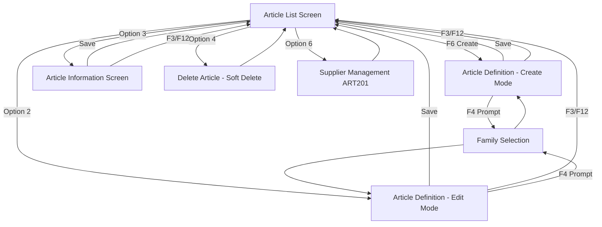

# ART200D - Work with Articles - Screen Analysis & Modernization Plan

## Executive Summary

This document provides a comprehensive analysis of the legacy IBM i Display File `ART200D` and outlines the modernization strategy to convert it into a modern React web application using IBM Carbon Design System.

---

## 1. Legacy Screen Analysis

### Screen 1: Article List (Subfile - SFL01/CTL01)

**Purpose**: Display paginated list of articles with action options

**Layout** (24x80 character display):
```
┌──────────────────────────────────────────────────────────────────────────────┐
│ ART200-1                      Work with Articles                  12/15/2025 │
│                                                                          17:22 │
│ Position to . . . [__________]                                               │
│ Type options, press Enter.                                                   │
│       2=Edit    3=Info    4=Delete    6=Suppliers                            │
│ Opt  Id     Description                                              Fam Del │
│ [_]  000001 Sample Article Description                               ABC     │
│ [_]  000002 Another Article                                          DEF     │
│ [_]  000003 Third Article Item                                       GHI     │
│ [_]  000004 Fourth Article                                           ABC     │
│ [_]  000005 Fifth Article Description                                JKL     │
│ [_]  000006 Sixth Article                                            MNO     │
│ [_]  000007 Seventh Article Item                                     PQR     │
│ [_]  000008 Eighth Article                                           STU     │
│ [_]  000009 Ninth Article Description                                VWX     │
│ [_]  000010 Tenth Article                                            YZA     │
│ [_]  000011 Eleventh Article Item                                    BCD     │
│ [_]  000012 Twelfth Article                                          EFG     │
│ [_]  000013 Thirteenth Article                                       HIJ     │
│ [_]  000014 Fourteenth Article Item                                  KLM     │
│                                                                              │
│ F3=Exit        F6=Create                                    F12=Cancel       │
└──────────────────────────────────────────────────────────────────────────────┘
```

**Key Features**:
- Dynamic subfile with 14 visible records per page
- Position-to field for quick navigation
- Row-level options: 2=Edit, 3=Info, 4=Delete, 6=Suppliers
- Function keys: F3=Exit, F6=Create, F12=Cancel
- Displays: Article ID, Description, Family code, Delete flag

---

### Screen 2: Article Definition (FMT02)

**Purpose**: Create or edit article details

**Layout**:
```
┌──────────────────────────────────────────────────────────────────────────────┐
│ ART200-2                   Article definition                                │
│                                                                               │
│ Type choices, press Enter.                                                   │
│                                                                               │
│ Article id . . . . . . : 000001                                              │
│ Description  . . . . . . [__________________________________________________]│
│ Familly. . . . . . . . . [___] Sample Family Description                     │
│ VAT code . . . . . . . . [_] 20.00% Standard VAT Rate                        │
│ Reference sale price . . [_______]                                           │
│          with VAT  . . : 120.00                                              │
│ Stock price  . . . . . . [_______]                                           │
│ Minimum stock  . . . . . [_____]                                             │
│ Stock  . . . . . . . . . [_____]                                             │
│                                                                               │
│                                                                               │
│                                                                               │
│                                                                               │
│                                                                               │
│                                                                               │
│                                                                               │
│                                                                               │
│ F3=Exit        F4=Prompt                                    F12=Cancel       │
└──────────────────────────────────────────────────────────────────────────────┘
```

**Key Features**:
- Article ID (display-only for edit, auto-generated for create)
- Description (required field, 50 chars)
- Family code with F4 prompt and description lookup
- VAT code with rate display and description
- Reference sale price with calculated VAT amount
- Stock price, minimum stock, current stock
- Validation: Description mandatory, Family must exist

---

### Screen 3: Article Information (FMT03)

**Purpose**: Manage extended article information (notes/details)

**Layout**:
```
┌──────────────────────────────────────────────────────────────────────────────┐
│ ART200-3                Article Informations                      12/15/2025 │
│ 000001 Sample Article Description                                      17:22 │
│ Make change. Press Enter to confirm                                          │
│ [____________________________________________________________________________]│
│ [____________________________________________________________________________]│
│ [____________________________________________________________________________]│
│ [____________________________________________________________________________]│
│ [____________________________________________________________________________]│
│ [____________________________________________________________________________]│
│ [____________________________________________________________________________]│
│ [____________________________________________________________________________]│
│ [____________________________________________________________________________]│
│ [____________________________________________________________________________]│
│ [____________________________________________________________________________]│
│ [____________________________________________________________________________]│
│ [____________________________________________________________________________]│
│ [____________________________________________________________________________]│
│ [____________________________________________________________________________]│
│ [____________________________________________________________________________]│
│ [____________________________________________________________________________]│
│                                                                               │
│ F3Exit                 F12Cancel                                             │
└──────────────────────────────────────────────────────────────────────────────┘
```

**Key Features**:
- Large text area (1520 characters)
- Stored in separate ARTIINF table
- Article ID and description displayed as context
- Simple save/cancel operations

---

## 2. Data Model

### Article Table (ARTICLE/FARTI)

| Field | Type | Length | Description |
|-------|------|--------|-------------|
| ARID | CHAR | 6 | Article ID (Primary Key) |
| ARDESC | CHAR | 50 | Article Description |
| ARSALEPR | DEC | 7,2 | Reference Sale Price |
| ARWHSPR | DEC | 7,2 | Stock/Warehouse Price |
| ARTIFA | CHAR | 3 | Family ID (Foreign Key) |
| ARSTOCK | DEC | 5,0 | Current Stock Quantity |
| ARMINQTY | DEC | 5,0 | Minimum Stock Quantity |
| ARCUSQTY | DEC | 5,0 | Customer Order Quantity |
| ARPURQTY | DEC | 5,0 | Purchase Order Quantity |
| ARVATCD | CHAR | 1 | VAT Code (Foreign Key) |
| ARCREA | DATE | - | Creation Date |
| ARMOD | TIMESTAMP | - | Last Modification |
| ARMODID | CHAR | 11 | Last Modified By User |
| ARDEL | CHAR | 1 | Delete Flag (X=Deleted) |

### Article Information Table (ARTIINF)

| Field | Type | Length | Description |
|-------|------|--------|-------------|
| ARTICLE_INFO_ID | CHAR | 6 | Article ID (Primary Key, FK) |
| ARTICLE_INFORMATION | CHAR | 1520 | Extended Information Text |

### Family Table (FAMILLY)

| Field | Type | Length | Description |
|-------|------|--------|-------------|
| FAID | CHAR | 3 | Family ID (Primary Key) |
| FADESC | CHAR | 50 | Family Description |

### VAT Definition Table (VATDEF/FVAT)

| Field | Type | Length | Description |
|-------|------|--------|-------------|
| VATCODE | CHAR | 1 | VAT Code (Primary Key) |
| VATRATE | DEC | 4,2 | VAT Rate Percentage |
| VATDESC | CHAR | 20 | VAT Description |

---

## 3. Business Logic Analysis

### Screen 1 - List Operations

**Load Subfile**:
1. Position to specified article (if POSTO field provided)
2. Read 14 records from ARTICLE2 logical file (sorted by ARDESC, ARID)
3. Display records with option field
4. Support pagination (pagedown loads next 14 records)

**Option Processing**:
- **Option 2 (Edit)**: Navigate to Screen 2 in UPDATE mode
- **Option 3 (Info)**: Navigate to Screen 3 to edit article information
- **Option 4 (Delete)**: Set ARDEL='X', update ARMOD timestamp and ARMODID
- **Option 6 (Suppliers)**: Call ART201 program (supplier management)

**Create (F6)**:
1. Generate next article ID (max ID + 1)
2. Navigate to Screen 2 in CREATE mode

### Screen 2 - Article Maintenance

**Create Mode**:
1. Auto-generate next Article ID
2. Initialize all fields to defaults
3. User enters data
4. Validate: Description required, Family must exist
5. Calculate VAT amount (ARSALEPR * (1 + VATRATE/100))
6. Write new record with ARCREA=current date, ARMOD=current timestamp

**Update Mode**:
1. Chain to article record by ARID
2. Display current values
3. User modifies data
4. Validate changes
5. Update record with ARMOD=current timestamp, ARMODID=current user

**F4 Prompt**:
- Opens family selection window
- Returns selected family code
- Displays family description

### Screen 3 - Article Information

**Load**:
1. SQL SELECT from ARTIINF where ARTICLE_INFO_ID = ARID
2. If not found, initialize empty text (CREATE mode)
3. Display article context (ID, description)

**Save**:
1. If UPDATE mode: SQL UPDATE ARTIINF
2. If CREATE mode: SQL INSERT into ARTIINF
3. Return to Screen 1

---

## 4. Validation Rules

### Field Validations

| Field | Rule | Error Message |
|-------|------|---------------|
| ARDESC | Required, not blank | "A description is mandatory" |
| ARTIFA | Must exist in FAMILLY table | ERR0001 from SAMMSGF |
| ARSALEPR | Numeric, >= 0 | Standard numeric validation |
| ARWHSPR | Numeric, >= 0 | Standard numeric validation |
| ARSTOCK | Numeric, >= 0 | Standard numeric validation |
| ARMINQTY | Numeric, >= 0 | Standard numeric validation |
| ARVATCD | Must exist in VATDEF table | Standard validation |

### Option Validations

| Option | Valid Values | Error Message |
|--------|--------------|---------------|
| OPT01 | 0, 2, 3, 4, 6 | "Invalid Option" |

---

## 5. User Experience Flow



---

## 6. Technical Dependencies

### RPG Program Dependencies

- **ART200.SQLRPGLE**: Main program controlling screen flow
- **ART201.RPGLE**: Supplier management (called from Option 6)
- **ART300.RPGLE**: Article utility functions
- **FAM300.RPGLE**: Family utility functions (GetArtFamDesc, ExistArtFam, SltArtFam)

### Database Files

- **ARTICLE (PF)**: Main article physical file
- **ARTICLE1 (LF)**: Logical file keyed by ARID
- **ARTICLE2 (LF)**: Logical file keyed by ARDESC, ARID (for sorted display)
- **ARTIINF (SQL Table)**: Article information text
- **FAMILLY (PF)**: Family master file
- **VATDEF (PF)**: VAT definition file

### Service Program Functions

From [`QPROTOSRC/ARTICLE.RPGLEINC`](QPROTOSRC/ARTICLE.RPGLEINC):
- `GetArtDesc(ARID)`: Get article description
- `GetArtRefSalPrice(ARID)`: Get reference sale price
- `GetArtStockPrice(ARID)`: Get stock price
- `GetArtFam(ARID)`: Get family ID
- `GetArtStock(ARID)`: Get current stock
- `GetArtMinStock(ARID)`: Get minimum stock
- `GetArtVatCode(ARID)`: Get VAT code
- `ExistArt(ARID)`: Check if article exists
- `IsArtDeleted(ARID)`: Check if article is deleted
- `SltArticle(ARID)`: Select an article
- `GetArtInfo(ARID)`: Get article information text

From [`QPROTOSRC/FAMILLY.RPGLEINC`](QPROTOSRC/FAMILLY.RPGLEINC):
- `GetArtFamDesc(FAID)`: Get family description
- `ExistArtFam(FAID)`: Check if family exists
- `IsArtFamDeleted(FAID)`: Check if family is deleted
- `SltArtFam(FAID)`: Select a family (prompt)

---

## Next Steps

This analysis provides the foundation for:
1. Designing the React component architecture
2. Defining REST API endpoints
3. Creating TypeScript interfaces
4. Specifying RPG Service Programs
5. Implementing the modernized solution

See the following documents for detailed implementation specifications.